# Db2 SQL ハンズオン

## 1. Db2 にアクセスする
IBM Cloud：https://cloud.ibm.com
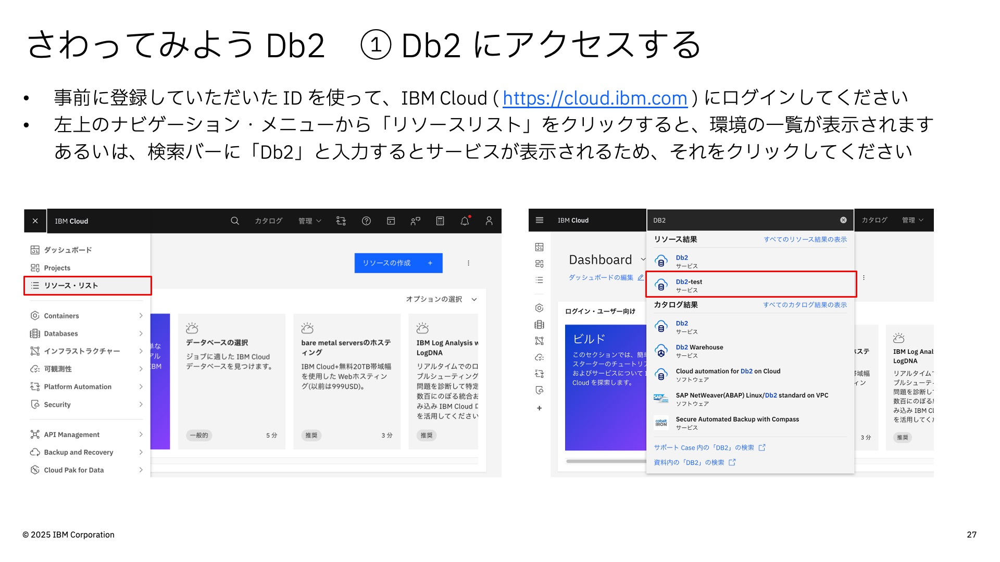
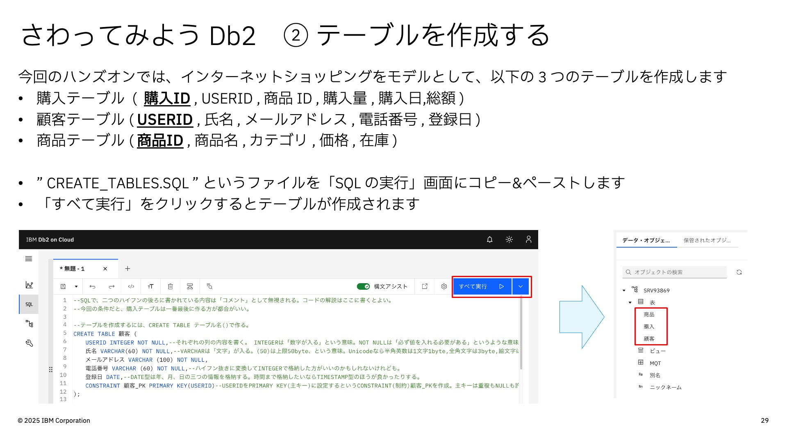

---

## 2. テーブルを作成する


- CREATE_TABLES.SQL は[こちら](data/CREATE_TABLES.SQL)

---

## 3. データを読み込む
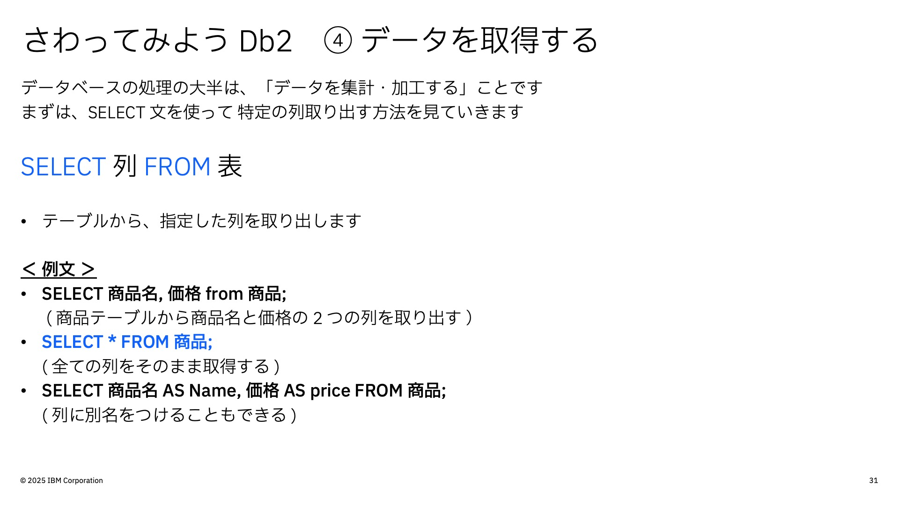
インポートするデータファイルは以下の 3 つです：
- 顧客データ：[users.csv](data/users.csv)
- 購入データ：[purchases.csv](data/purchases.csv)
- 商品データ：[products.csv](data/products.csv)

---

## 3. データの取得・集計

### 3.1 データを取得する （ SELECT ）

```sql
SELECT 商品名, 価格 FROM 商品;
```
```sql
SELECT * FROM 商品;
```
```sql
SELECT 商品名 AS Name, 価格 AS price FROM 商品;
```
<br>

#### テーブルが開けない場合 （ 整合性チェック ）
データをインポートした後、テーブルを開けない場合があります。  
その場合は、以下のSQLを実行して **テーブルの整合性チェック** を行ってください。
```sql
SET INTEGRITY FOR 商品 IMMEDIATE CHECKED;
```
```sql
SET INTEGRITY FOR 顧客 IMMEDIATE CHECKED;
```
```sql
SET INTEGRITY FOR 購入 IMMEDIATE CHECKED;
```
<br>

#### 練習問題 1

顧客テーブルから、氏名とメールアドレスを取得し、英語名（Name, Email）で表示してください。

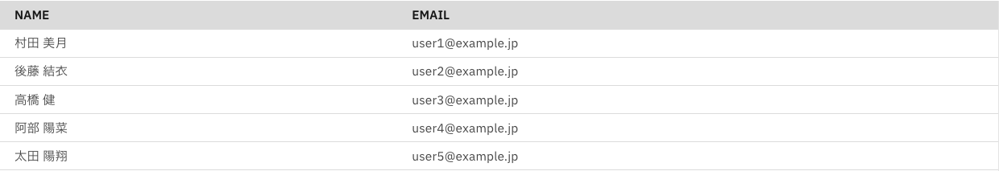

<details>
<summary>回答例を見る</summary>

```sql
SELECT 氏名 AS Name, メールアドレス AS Email FROM 顧客;
```

</details>

---

### 3.2 条件を指定してデータを取得する（WHERE）
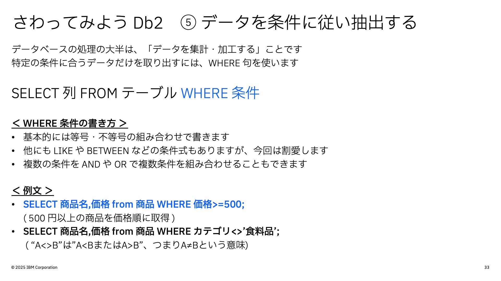
```sql
SELECT 商品名, 価格 
FROM 商品 
WHERE 価格 >= 500 
ORDER BY 価格;
```
```sql
SELECT 商品名, 価格 
FROM 商品 
WHERE カテゴリ <> '食料品' 
ORDER BY 価格;
```

#### 練習問題 2

商品テーブルから、在庫が 50 未満の商品を取得し、価格の高い順に並べて表示してください。

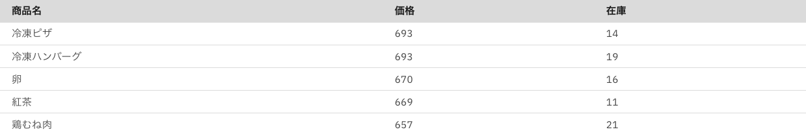

<details>
<summary>回答例を見る</summary>

```sql
SELECT 商品名, 価格, 在庫
FROM 商品
WHERE 在庫 < 50
ORDER BY 価格 DESC;
```

</details>

---

### 3.3 集約関数を使用する（GROUP BY）
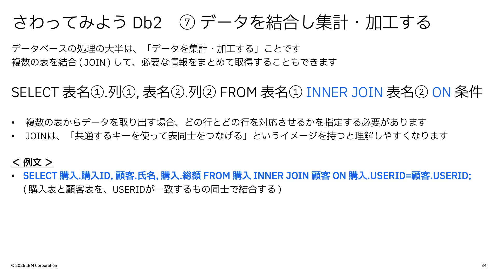
```sql
SELECT 
    カテゴリ,
    COUNT(*) AS 個数,
    AVG(価格) AS 平均価格
FROM 商品
GROUP BY カテゴリ;
```

#### 練習問題 3

購入テーブルから、商品IDごとに購入回数（件数）を集計し、表示してください。

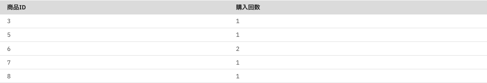

<details>
<summary>回答例を見る</summary>

```sql
SELECT
    商品ID,
    COUNT(*) AS 購入回数
FROM 購入
GROUP BY 商品ID;
```

</details>

<br>

#### 練習問題 3 +

購入テーブルから、ユーザーごとの総購入額と購入件数を集計し、総購入額が大きい順に並べて表示してください。

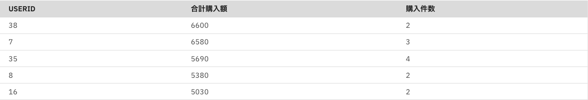

<details>
<summary>回答例を見る</summary>

```sql
SELECT 
    UserID,
    SUM(総額) AS 合計購入額,
    COUNT(*) AS 購入件数
FROM 購入
GROUP BY UserID
ORDER BY 合計購入額 DESC;
```

</details>

---

### 3.4 テーブルを結合する（INNER JOIN）

```sql
SELECT 
    購入.購入ID,
    顧客.氏名
FROM 購入
INNER JOIN 顧客 
ON 購入.USERID = 顧客.USERID;
```

#### 練習問題 4

購入テーブルと商品テーブルを結合し、購入IDと商品名を表示してください。

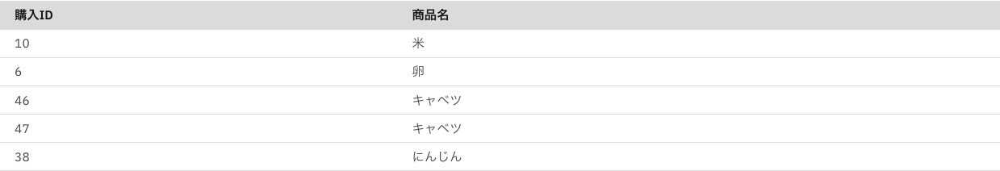

<details>
<summary>回答例を見る</summary>

```sql
SELECT 
    購入.購入ID,
    商品.商品名
FROM 購入
INNER JOIN 商品
ON 購入.商品ID = 商品.商品ID;
```

</details>

<br>

#### 練習問題 4 +

購入テーブル・顧客テーブル・商品テーブルの3つを結合し、氏名・商品名・購入量を取得してください。

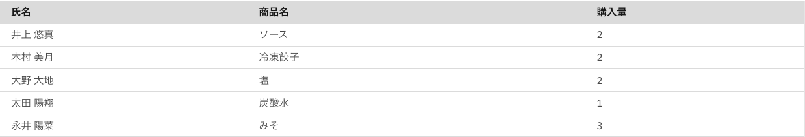

<details>
<summary>回答例を見る</summary>

```sql
SELECT 
    顧客.氏名,
    商品.商品名,
    購入.購入量
FROM 購入
INNER JOIN 顧客
    ON 購入.UserID = 顧客.UserID
INNER JOIN 商品
    ON 購入.商品ID = 商品.商品ID;
```

</details>

---

## 4. データの追加・更新・削除
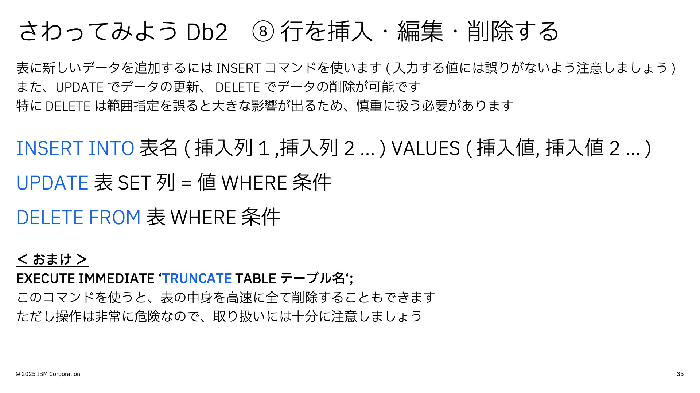

### 4.1 データを挿入する（INSERT）
まず、`USERID = 51` のデータが存在しないことを確認します。
```sql
SELECT * 
FROM 顧客 
WHERE USERID = 0051;
```

顧客データを追加します。

```sql
INSERT INTO 顧客 
(USERID, 氏名, メールアドレス, 電話番号)
VALUES 
(0051, '好きな名前を入れてください', '適当なメールアドレス', '電話番号');
```

確認します。

```sql
SELECT * 
FROM 顧客 
WHERE USERID = 0051;
```
---

### 4.2 データを更新する（UPDATE）
電話番号を更新します。
```sql
UPDATE 顧客
SET 電話番号 = '080-6527-9271'
WHERE USERID = 0051;
```
確認します。
```sql
SELECT * 
FROM 顧客 
WHERE USERID = 0051;
```
---

### 4.4 データを削除する（DELETE）

顧客データを削除します。

```sql
DELETE FROM 顧客
WHERE USERID = 0051;
```

確認します。

```sql
SELECT * 
FROM 顧客 
WHERE USERID = 0051;
```

---

## 追加練習問題（早く終わった人向け）

時間が余った方は、以下の問題に挑戦してみてください。  

#### 追加練習問題 1

商品テーブルと購入テーブルを結合し、価格が 500 円以上の商品だけを対象に、購入ID・商品名・価格を表示してください。

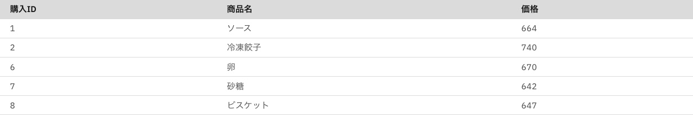

<details>
<summary>回答例を見る</summary>

```sql
SELECT 
    購入.購入ID,
    商品.商品名,
    商品.価格
FROM 購入
INNER JOIN 商品
    ON 購入.商品ID = 商品.商品ID
WHERE 商品.価格 >= 500;
```

</details>

<br>

#### 追加練習問題 2

商品カテゴリごとに総購入量（購入量の合計）を集計し、購入量が多い順にカテゴリ名と合計購入量を表示してください。

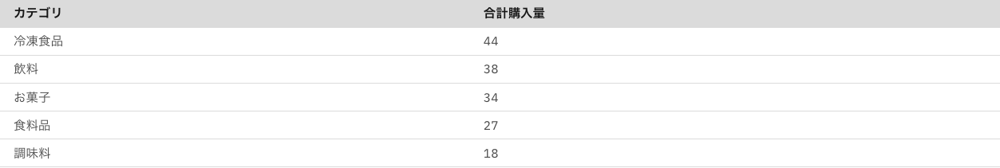

<details>
<summary>回答例を見る</summary>

```sql
SELECT
    商品.カテゴリ,
    SUM(購入.購入量) AS 合計購入量
FROM 購入
INNER JOIN 商品
    ON 購入.商品ID = 商品.商品ID
GROUP BY 商品.カテゴリ
ORDER BY 合計購入量 DESC;
```

</details>

<br>

#### 追加練習問題 3

顧客・購入・商品テーブルを結合し、飲料カテゴリ以外の商品について、顧客ごと・商品ごとの購入量を集計し、購入量の多い順に表示してください。

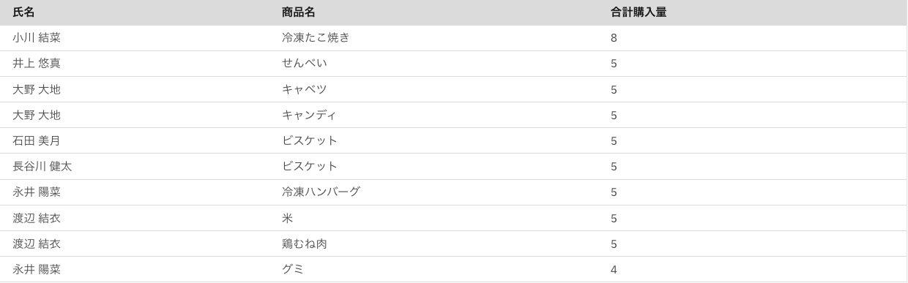

<details>
<summary>回答例を見る</summary>

```sql
SELECT
    顧客.氏名,
    商品.商品名,
    SUM(購入.購入量) AS 合計購入量
FROM 購入
INNER JOIN 顧客
    ON 購入.UserID = 顧客.UserID
INNER JOIN 商品
    ON 購入.商品ID = 商品.商品ID
WHERE 商品.カテゴリ <> '飲料'
GROUP BY 顧客.氏名, 商品.商品名
ORDER BY 合計購入量 DESC;
```

</details>